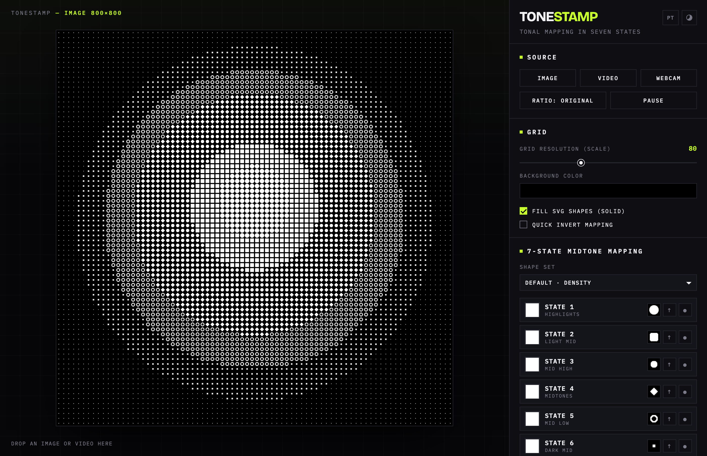
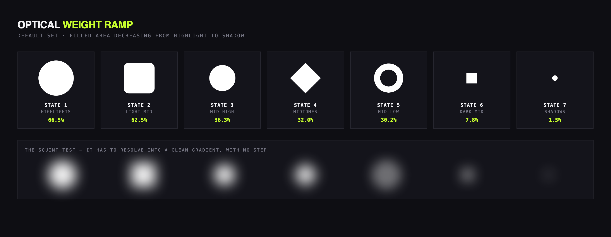
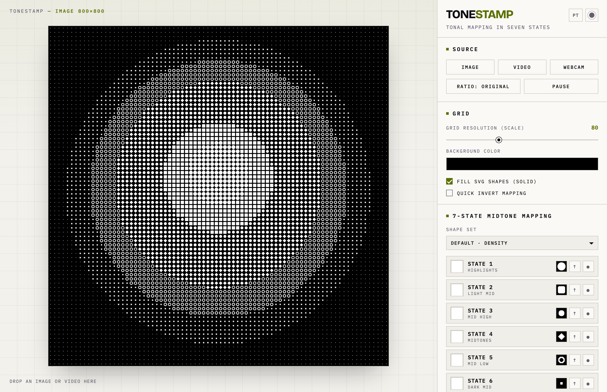

**English** · [Português](README.pt-BR.md)

# Tonestamp

Tonal halftone that reads the luminance of each grid cell and stamps a custom SVG shape in its place. One HTML file, no install, no server, no build step.

[](LICENSE)
[](NOTICE.md)
[](https://haruway.github.io/tonestamp/)

<!--
  DEMO GIF GOES HERE. Shot list and recipe: docs/assets/README.md
  
-->



**[Live demo →](https://haruway.github.io/tonestamp/)**

---

## What it does

The tool lays a grid over an image or video, reads the **brightness** of each cell, sorts it into one of **seven tonal bands** — highlight to shadow — and stamps the SVG shape assigned to that band.

This is not ASCII art and it is not pixel art. It is halftone with a shape you drew yourself.

Seven states exist because the image is built from **luminance**, not colour. Colour is an independent axis stacked on top, with three modes.

The whole thing depends on one rule: the seven shapes must form a **monotonic ramp of filled area**. Break the ramp and the face disappears.



That bottom row is the squint test: blur the set and it has to read as a smooth gradient, with no step going the wrong way. The reasoning is written up in [docs/shape-design.md](docs/shape-design.md), and `npm run ramp` measures it so a regression cannot ship.

## Quick start

1. Download [`dist/index.html`](dist/index.html).
2. Double-click it.

That is the whole thing. No npm, no server, no dependencies, and **no network** — the typefaces are embedded, so it renders identically on a plane. Drag an image onto the canvas and start moving sliders.

## Features

- **Seven-state tonal mapping.** Upload your own SVG per band, or use the bundled set. Turn a state off to leave that tonal band empty.
- **Three colour modes.** *State* — one fixed colour per band. *Pixel* — each cell samples the real colour at that point. *Quantize* — the pixel colour snaps to the nearest colour in a palette extracted from the image via k-means. Quantize is what gives you the flat screen-print look.
- **Tone controls before mapping.** Brightness, contrast and gamma change *which state a cell lands in*, not just how it looks. If your image is only using three of the seven states, that is a tonal distribution problem — fix it here.
- **Scale and rotation.** Vary shape size within a band to soften the edges between states, and snap-rotate cells by 90° to break false directionality in asymmetric shapes.
- **Real vector export.** SVG export emits one `<symbol>` per shape-colour pair and one `<use>` per cell. Opens in Illustrator fully editable — it is not a traced bitmap.
- **PNG and WebM export.** Still frames up to 3000px, or record the canvas at 30fps for animated and video sources.
- **Image, video and webcam sources**, with drag and drop.
- **Presets.** Save the entire configuration as JSON, shapes embedded as text so the file is portable. Four worked examples in [`examples/`](examples/).
- **Portuguese and English**, switchable in the header.
- **Dark and light themes**, remembered across sessions, following your OS preference on first visit. The UI theme is fully independent of the composition's background colour.



Note the composition stays black while the interface goes light. Those two are separate settings, on purpose — the background colour of your artwork is your decision, not a side effect of the theme you read the panel in.

## Bring your own shapes

Draw seven SVGs on square 100×100 artboards, single colour, strokes expanded, holes as compound paths. Upload each one with the `↑` button on its state.

The part that actually matters is *which* seven shapes. Optical weight is not the same as filled area — a ring reads lighter than its area suggests, because the hole registers as light. Getting the ramp right is the difference between a portrait and a smudge.

The full reasoning, the three scale strategies that work, and the Illustrator export settings are in **[docs/shape-design.md](docs/shape-design.md)**. The bundled set lives in [`shapes/default/`](shapes/default/).

## Documentation

Everything is available in both languages.

| Document | What it covers |
|---|---|
| [docs/manual.md](docs/manual.md) · [pt-BR](docs/manual.pt-BR.md) | Every control, what it does, and known limitations. |
| [docs/shape-design.md](docs/shape-design.md) · [pt-BR](docs/shape-design.pt-BR.md) | How to design a shape set that works. |
| [examples/README.md](examples/README.md) · [pt-BR](examples/README.pt-BR.md) | The four example presets and the JSON format. |
| [CONTRIBUTING.md](CONTRIBUTING.md) · [pt-BR](CONTRIBUTING.pt-BR.md) | Setup, architecture, how to add a module. |
| [NOTICE.md](NOTICE.md) | What this project is, and what I am asking of you. |

## Development

```bash
git clone https://github.com/haruway/tonestamp.git
cd tonestamp

npm run serve      # serve src/ at :8080 — ES modules need HTTP, not file://
npm run build      # inline src/ into dist/index.html
npm run verify     # dist freshness + contrast + shape ramp
```

Edit `src/`, never `dist/`. The build script is plain Node with **zero dependencies** — it inlines the stylesheets, base64-embeds the fonts, walks the ES module graph from `src/js/main.js`, and concatenates everything into one file in topological order.

Source layout:

```
src/js/
  state.js      central state + tiny pub/sub           (no DOM)
  shapes.js     SVG parsing, rasterising, tint cache   (no page DOM)
  palette.js    k-means, colour maths, per-cell colour (no page DOM)
  renderer.js   sampling, tone mapping, the draw loop  (canvas only)
  export.js     PNG, vector SVG, WebM
  sources.js    file, video, webcam, drag and drop
  presets.js    save/load configuration as JSON
  i18n.js       pt/en dictionary and the language toggle
  theme.js      dark/light toggle
  main.js       boot and all DOM wiring
```

`renderer.js`, `palette.js` and `shapes.js` never touch the page DOM beyond a canvas passed in as a parameter, and they return error *keys* rather than sentences so they stay language-agnostic. Keep it that way — it is what makes them testable and reusable.

`dist/index.html` is committed on purpose, so anyone can download and run it without a toolchain. CI fails if it drifts from `src/`.

## Browser support

| | Chrome | Firefox | Safari |
|---|---|---|---|
| Core rendering | ✅ | ✅ | ✅ |
| PNG / SVG export | ✅ | ✅ | ✅ |
| WebM recording | ✅ | ✅ | ❌ not implemented |
| Webcam from `file://` | usually allowed | usually allowed | often blocked — serve over https |

## Free, and please keep it that way

Tonestamp is MIT licensed, which means you may use it commercially, modify it, and sell the artwork you make with it. All of that is intended.

There is no paid tier and there never will be. **Please do not resell the tool itself** — not as a paid app, a paid template, or a marketplace listing. That is a request rather than a licence restriction, and [NOTICE.md](NOTICE.md) explains why it is written that way instead of being enforced in the licence.

## Credits

The technique comes from **[Anton Burmistrov (@antoncreations)](https://www.instagram.com/antoncreations/)**, who demonstrated it in a reel on 18 May 2026 with the Makoto San poster series. This project is an independent implementation of that idea with additional controls — the original insight is his.

Only the seven default shapes created for this project are included here. None of the original Makoto San artwork ships with this repository.

Typefaces: [Bricolage Grotesque](https://github.com/ateliertriay/bricolage) and [IBM Plex Mono](https://github.com/IBM/plex), both SIL Open Font License 1.1.

## License

MIT — see [LICENSE](LICENSE). Bundled fonts keep their own OFL licence, included in [`src/fonts/`](src/fonts/).
