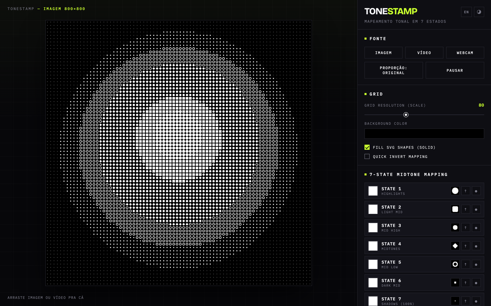
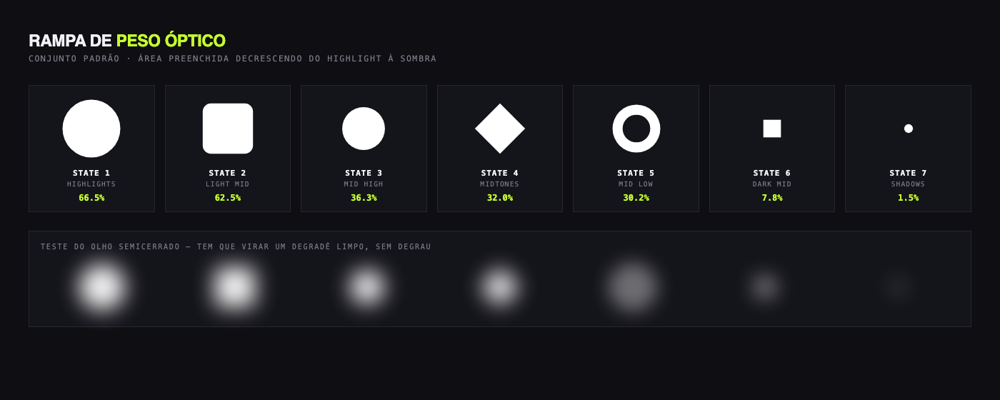

**Português** · [English](README.md)

# Tonestamp

Meio-tom tonal que lê a luminância de cada célula do grid e carimba no lugar dela uma shape SVG customizada. Um arquivo HTML, sem instalação, sem servidor, sem build.

[](LICENSE)
[](NOTICE.md)
[](https://haruway.github.io/tonestamp/)

<!--
  O GIF DE DEMONSTRAÇÃO ENTRA AQUI. Roteiro e receita: docs/assets/README.pt-BR.md
  
-->



**[Demo ao vivo →](https://haruway.github.io/tonestamp/)**

---

## O que faz

A ferramenta joga um grid sobre uma imagem ou vídeo, lê o **brilho** de cada célula, classifica em uma de **sete faixas tonais** — do highlight à sombra — e carimba a shape SVG atribuída àquela faixa.

Não é ASCII art e não é pixel art. É meio-tom com uma forma que você desenhou.

São sete estados porque a imagem se forma por **luminância**, não por cor. A cor é um eixo independente empilhado por cima, com três modos.

Tudo depende de uma regra só: as sete shapes precisam formar uma **rampa monotônica de área preenchida**. Quebre a rampa e o rosto some.



A fileira de baixo é o teste do olho semicerrado: desfoque o conjunto e ele tem que virar um degradê suave, sem nenhum degrau na direção errada. O raciocínio está em [docs/shape-design.pt-BR.md](docs/shape-design.pt-BR.md), e o `npm run ramp` mede isso pra que uma regressão não passe.

## Começando

1. Baixe o [`dist/index.html`](dist/index.html).
2. Dê dois cliques.

É só isso. Sem npm, sem servidor, sem dependência, e **sem rede** — as fontes vão embutidas, então renderiza igual dentro de um avião. Arraste uma imagem pro canvas e comece a mexer nos sliders.

## Recursos

- **Mapeamento tonal em 7 estados.** Suba seu próprio SVG por faixa, ou use o conjunto embutido. Desligue um estado pra deixar aquela faixa tonal vazia.
- **Três modos de cor.** *Estado* — uma cor fixa por faixa. *Pixel* — cada célula puxa a cor real daquele ponto. *Quantizar* — a cor do pixel gruda na cor mais próxima de uma paleta extraída da imagem por k-means. Quantizar é o que dá o look chapado de serigrafia.
- **Controles de tom antes do mapeamento.** Brilho, contraste e gamma mudam *em qual estado a célula cai*, não só a aparência. Se a sua imagem só está usando três dos sete estados, o problema é distribuição tonal — resolve aqui.
- **Escala e rotação.** Varie o tamanho da shape dentro da faixa pra suavizar as bordas entre estados, e gire as células em 90° pra quebrar direção falsa em shapes assimétricas.
- **Export vetorial de verdade.** O SVG sai com um `<symbol>` por combinação de shape e cor, e um `<use>` por célula. Abre no Illustrator totalmente editável — não é bitmap traçado.
- **Export PNG e WebM.** Quadros até 3000px, ou grava o canvas a 30fps pra fontes animadas e vídeo.
- **Fontes de imagem, vídeo e webcam**, com arrastar e soltar.
- **Presets.** Salva a configuração inteira como JSON, com as shapes embutidas como texto pro arquivo ser portátil. Quatro exemplos prontos em [`examples/`](examples/).
- **Português e inglês**, alternáveis no cabeçalho.
- **Temas escuro e claro**, lembrados entre sessões, seguindo a preferência do sistema na primeira visita. O tema da interface é totalmente independente da cor de fundo da composição.

## Traga suas próprias shapes

Desenhe sete SVGs em pranchetas quadradas de 100×100, uma cor só, traçados expandidos, furos em caminho composto. Suba cada um pelo botão `↑` do estado.

O que realmente importa é *quais* sete shapes. Peso óptico não é a mesma coisa que área preenchida — um anel lê mais leve do que a área dele sugere, porque o furo registra como luz. Acertar a rampa é a diferença entre um retrato e um borrão.

O raciocínio completo, as três estratégias de escala que funcionam e as configurações de export do Illustrator estão em **[docs/shape-design.pt-BR.md](docs/shape-design.pt-BR.md)**. O conjunto embutido está em [`shapes/default/`](shapes/default/).

## Documentação

Tudo disponível nos dois idiomas.

| Documento | O que cobre |
|---|---|
| [docs/manual.pt-BR.md](docs/manual.pt-BR.md) · [EN](docs/manual.md) | Cada controle, o que faz, e as limitações conhecidas. |
| [docs/shape-design.pt-BR.md](docs/shape-design.pt-BR.md) · [EN](docs/shape-design.md) | Como desenhar um conjunto de shapes que funciona. |
| [examples/README.pt-BR.md](examples/README.pt-BR.md) · [EN](examples/README.md) | Os quatro presets de exemplo e o formato do JSON. |
| [CONTRIBUTING.pt-BR.md](CONTRIBUTING.pt-BR.md) · [EN](CONTRIBUTING.md) | Setup, arquitetura, como adicionar um módulo. |
| [NOTICE.md](NOTICE.md) | O que este projeto é, e o que eu peço de você. |

## Desenvolvimento

```bash
git clone https://github.com/haruway/tonestamp.git
cd tonestamp

npm run serve      # serve src/ na :8080 — ES modules precisam de HTTP, não file://
npm run build      # embute src/ em dist/index.html
npm run verify     # dist em dia + contraste + rampa tonal
```

Edite `src/`, nunca `dist/`. O build é Node puro com **zero dependência** — ele embute as folhas de estilo, converte as fontes em base64, percorre o grafo de ES modules a partir de `src/js/main.js` e concatena tudo num arquivo só, em ordem topológica.

Organização do código:

```
src/js/
  state.js      estado central + pub/sub mínimo         (sem DOM)
  shapes.js     parse de SVG, rasterização, cache        (sem DOM da página)
  palette.js    k-means, matemática de cor, cor da célula (sem DOM da página)
  renderer.js   amostragem, mapeamento tonal, loop        (só o canvas)
  export.js     PNG, SVG vetorial, WebM
  sources.js    arquivo, vídeo, webcam, arrastar e soltar
  presets.js    salvar/carregar configuração como JSON
  i18n.js       dicionário pt/en e o botão de idioma
  theme.js      alternância escuro/claro
  main.js       boot e todo o wiring de DOM
```

`renderer.js`, `palette.js` e `shapes.js` não tocam no DOM da página além do canvas que recebem por parâmetro, e devolvem *chaves* de erro em vez de frases, pra continuarem livres de idioma. Mantenha assim — é o que os torna testáveis e reutilizáveis.

O `dist/index.html` é versionado de propósito, pra qualquer pessoa baixar e rodar sem toolchain. O CI falha se ele divergir de `src/`.

## Suporte de navegador

| | Chrome | Firefox | Safari |
|---|---|---|---|
| Render principal | ✅ | ✅ | ✅ |
| Export PNG / SVG | ✅ | ✅ | ✅ |
| Gravação WebM | ✅ | ✅ | ❌ não implementado |
| Webcam via `file://` | costuma liberar | costuma liberar | costuma bloquear — sirva por https |

## Gratuito, e por favor continue assim

O Tonestamp é MIT, o que significa que você pode usar comercialmente, modificar, e vender a arte que produzir com ele. Tudo isso é intencional.

Não existe versão paga e não vai existir. **Por favor, não revenda a ferramenta em si** — nem como aplicativo pago, nem como template pago, nem em marketplace. Isso é um pedido, não uma restrição de licença, e o [NOTICE.md](NOTICE.md) explica por que está escrito assim em vez de estar travado na licença.

## Créditos

A técnica vem do **[Anton Burmistrov (@antoncreations)](https://www.instagram.com/antoncreations/)**, que mostrou o processo num reel de 18/05/2026 com a série de pôsteres do Makoto San. Este projeto é uma implementação independente daquela ideia, com controles a mais — a sacada original é dele.

Só as sete shapes padrão criadas pra este projeto estão incluídas aqui. Nenhuma arte original do Makoto San acompanha este repositório.

Tipografia: [Bricolage Grotesque](https://github.com/ateliertriay/bricolage) e [IBM Plex Mono](https://github.com/IBM/plex), ambas SIL Open Font License 1.1.

## Licença

MIT — veja [LICENSE](LICENSE). As fontes embutidas mantêm a licença OFL delas, incluída em [`src/fonts/`](src/fonts/).
